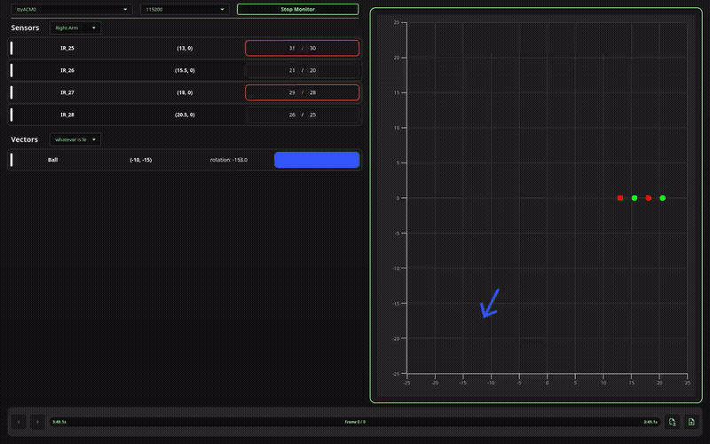

# Roboticus Data Visualiser

[](https://www.gnu.org/licenses/gpl-3.0)



A desktop Qt application for visualising live robot telemetry from a serial stream.

Designed for robotics debugging workflows: stream sensor values in real time, draw directional vectors, group telemetry into layers, scrub through captured frames on a timeline, and save/load sessions as JSON snapshots.

The app expects framed MsgPack packets over serial. Example senders are included for Arduino and Python (for testing without hardware).

## Contents

- [Features](#features)
- [Getting Started](#getting-started)
- [Installation](#installation)
  - [Windows](#windows)
  - [Linux](#linux)
  - [RoboticusDebugger Library](#roboticusdebugger-library)
- [Project Structure](#project-structure)
- [Serial Frame Protocol](#serial-frame-protocol)
- [Snapshot JSON Format](#snapshot-json-format)
- [Troubleshooting](#troubleshooting)
- [Contributing](#contributing)

## Features

- **Live serial monitoring** with selectable COM/TTY port and baud rate
- **2D graph visualisation** of sensors (value, threshold, triggered state, x/y position) and vectors (rotation, colour, x/y position)
- **Layer-based filtering** for sensors and vectors
- **Timeline playback/scrubbing** across captured frames
- **Save and load** telemetry sessions as JSON snapshots
- Example code (Arduino library + sketch, Python script with virtual comports)

## Getting Started

1. Launch the app.
2. Select a serial port and baud rate in the top connection bar.
3. Click **Start Monitor**.
4. Stream telemetry from your microcontroller using the [RoboticusDebugger](https://github.com/sSpectrals/RoboticusDebugger) Arduino library.
5. Use the left panel to inspect sensors/vectors and switch layers.
6. Hover over a sensor in the graph to see individual values.
7. Use the bottom timeline to scrub frames, step backward/forward, save the session, or load a previous JSON snapshot.

## Installation

### Windows

1. Download `windows-build.zip` from [GitHub Releases](https://github.com/sSpectrals/RoboticusDebugger/releases).
2. Unzip and run the `.exe`. Windows may show an "untrusted" warning since the executable is unsigned.

### Linux

```bash
flatpak install --user com.roboticus.DataVisualiser-x86_64.flatpak
```

Download the `.flatpak` from [GitHub Releases](https://github.com/sSpectrals/RoboticusDebugger/releases) first.

### RoboticusDebugger Library

**Arduino IDE:** search `RoboticusDebugger` in the Library Manager.  
**PlatformIO:** search `RoboticusDebugger` in the PlatformIO Library Manager.
**Python** Download the RoboticusDebugger.py && Example.py from https://github.com/sSpectrals/RoboticusDebugger 

An example sketch is included in the library.

## Project Structure

| Path | Contents |
|---|---|
| `src/`, `include/` | C++ core logic — controllers, models, serial parser, snapshot store |
| `ui/` | QML UI components — graph, monitor panes, timeline, connection bar |
| `libs/qmsgpack/` | Bundled MsgPack dependency |
| `assets/SVG/` | App images |

## Serial Frame Protocol

Frames are MsgPack payloads with this wire format:

| Field | Size | Description |
|---|---|---|
| Start byte | 1 byte | `0xFD` |
| Payload length | 2 bytes | Little-endian `uint16` |
| Payload | variable | MsgPack-encoded array `[sensors, vectors, timestamp_ms]` |

**Sensor entry:** `[name, input, isTriggered, threshold, layer, x, y]`  
**Vector entry:** `[name, rotation, color, layer, x, y]`  
**`timestamp_ms`:** integer milliseconds (`millis()` on Arduino)

Frames with empty sensors and vectors are ignored. Payloads outside expected size bounds are rejected by the frame extractor.

## Snapshot JSON Format

Sessions are saved as JSON arrays of snapshots. Each snapshot contains:

- `timestamp`
- `sensors[]` — `name`, `input`, `threshold`, `isTriggered`, `layer`, `location.{x,y}`
- `vectors[]` — `name`, `rotation`, `scale`, `color`, `layer`, `location.{x,y}`

## Troubleshooting

**No serial ports visible**

- Check your cable and device permissions.
- Verify the OS detects the device.

**Cannot connect to port**

- Close other tools using the port (Arduino Serial Monitor, etc.).
- Confirm the baud rate matches the sender.

**No data shown**

- Check that your microcontroller has enough RAM for the MsgPack payload. For example, 40 sensors won't fit in 8 KB of SRAM on an Arduino Mega — send smaller packets in multiple writes instead of one large `.write()`.

**Loaded file fails**

- Ensure the file is valid JSON matching the snapshot schema above.

## Contributing

Issues and pull requests are welcome. When reporting a bug, please include:

- OS
- Qt version
- Steps to reproduce
